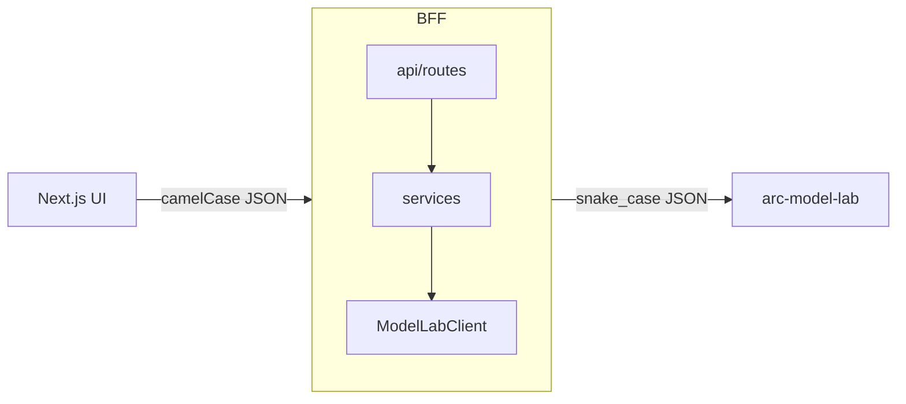

# ARC Research Console

Audience: ARC platform engineers. Reading time: 6 minutes.

The internal research console for ARC. A FastAPI BFF plus a Next.js UI that give
senior AI and research engineers direct, honest access to two capabilities: the
model catalog and inference. The surface is dark-first, table-friendly, and
keyboard-driven, with raw access to what the platform actually knows.

The console holds no database of its own (by design) and stores no provider keys.
Its only downstream is arc-model-lab, which owns the model catalog and persists
every inference run. The browser talks only to the BFF; the BFF talks only to
arc-model-lab.

```text
arc-platform/
  backend/                     # FastAPI BFF (strict src/ layout)
    src/arc_platform/
      main.py                  # app assembly + exception handlers
      api/routes/              # health, models, inference (routing only)
      services/                # serving policy (ordering, limits)
      clients/                 # ModelLabClient: I/O + snake->camel normalization
      core/                    # config, logging, telemetry seam, errors, DI
      schemas/                 # Pydantic request/response contracts (camelCase)
    tests/                     # unit / contract / integration / e2e
  frontend/                    # Next.js App Router console (see frontend/README.md)
    src/{app,components,lib,styles}   # routes, layout + UI, preferences, design tokens
  docker/  pyproject.toml  Makefile  README.md
```

## Architecture

One-directional layering: api to services to client to arc-model-lab, with
`core` and `schemas` as cross-cutting support.



- Normalization. arc-model-lab speaks snake_case. The client maps its records
  onto curated Pydantic contracts, and FastAPI serializes them to camelCase for
  the TypeScript frontend. Inbound request bodies accept either form.
- Graceful degradation. Catalog and history reads return an empty list when
  arc-model-lab is unreachable, so a surface still renders. Single-resource reads
  return 404 (missing) or 503 (unreachable). Inference, a user action, fails
  loudly with 502 (bad response) or 503 (unreachable).
- Telemetry seam. `core/telemetry.py` uses the shared `arc-telemetry` SDK when it
  is installed and falls back to stdlib structured logging with no-op tracing when
  it is not, so fresh clones and minimal CI images still run.

## API

Browser-facing contract (camelCase). Interactive docs at
`http://localhost:8001/docs`.

| Method and path             | Description                                  |
| --------------------------- | -------------------------------------------- |
| `GET /health`               | Liveness probe                               |
| `GET /v1/models`            | Model catalog, ordered by provider then name |
| `GET /v1/models/{model_id}` | Full model profile (404 if unknown)          |
| `POST /v1/inference`        | Run one inference (201 Created)              |
| `GET /v1/inference?limit=`  | Recent runs, most recent first               |
| `GET /v1/inference/{id}`    | Full inference record (404 if unknown)       |

Errors use a structured envelope: `{"detail": "...", "code": "..."}`. Codes are
`not_found`, `upstream_error`, `service_unavailable`, and `internal_error`.

## Data model

Local Pydantic contracts in `backend/src/arc_platform/schemas/` (not a shared
package yet, per YAGNI):

- Models: `ModelSummary` (catalog row), `ModelDetail` (full profile),
  `ModelStatus`. Summaries carry serving metadata (`revision`, `tokenizerId`,
  `adapterPath`, `createdAt`, `updatedAt`); detail adds `runtimeSource`,
  `description`, and `capabilities`.
- Inference: `InferenceRequest`, `InferenceSummary` (history row),
  `InferenceDetail`, `InferenceParams`, `TokenUsage`, `InferenceStatus`.

Response models serialize to camelCase; `InferenceRequest` accepts camelCase or
snake_case.

## Running locally

The BFF needs arc-model-lab as its downstream.

### Backend (uv)

```bash
make prepare                 # uv sync (resolves arc-telemetry)
make bff.run                 # uvicorn on :8001, reload
# or, pointing at a specific arc-model-lab:
ARC_PLATFORM_MODEL_LAB_URL=http://localhost:8000 \
  uv run uvicorn arc_platform.main:app --reload --reload-dir backend/src --port 8001
curl -s localhost:8001/v1/models | head
```

### Frontend (Next.js)

Dark-first App Router console. Details in [frontend/README.md](frontend/README.md).

```bash
make web.install             # npm install
make web.dev                 # dev server on :3000
# or, pointing the browser at a specific BFF:
cd frontend && NEXT_PUBLIC_API_BASE=http://localhost:8001 npm run dev
```

### Configuration

| Variable                                     | Default                 | Meaning                          |
| -------------------------------------------- | ----------------------- | -------------------------------- |
| `ARC_PLATFORM_MODEL_LAB_URL`                 | `http://localhost:8000` | arc-model-lab base URL           |
| `ARC_PLATFORM_MODEL_LAB_TIMEOUT_S`           | `15.0`                  | catalog and history read timeout |
| `ARC_PLATFORM_MODEL_LAB_INFERENCE_TIMEOUT_S` | `120.0`                 | single-generation timeout        |
| `ARC_PLATFORM_CORS_ORIGINS`                  | `http://localhost:3000` | allowed UI origin                |
| `NEXT_PUBLIC_API_BASE` (UI)                  | `http://localhost:8001` | BFF base URL for the browser     |

## Testing

```bash
make bff.test                # full suite + coverage gate (fails under 80%)
make bff.contract            # ModelLabClient wire contract (respx)
uv run pytest -m unit        # service + mapper logic
uv run pytest -m integration # API via httpx AsyncClient (fake downstream)
uv run pytest -m e2e         # run -> history -> detail flow
```

Tests need no external services: a stateful `FakeModelLabClient` and respx stand
in for arc-model-lab. `asyncio_mode = auto`.

## Quality gate

```bash
make bff.lint                # ruff format --check + ruff check
make bff.typecheck           # mypy --strict
make check                   # lint + tests + coverage (full CI gate)
```

Coverage is branch-enabled, `fail_under = 80` (currently about 95%).

Frontend gates mirror these: `make web.lint`, `make web.typecheck`, `make web.test`,
or `make web.check` for all three.

## Docker

```bash
make docker                  # build backend image
make docker-run              # build + run on :8001
```

The image installs the shared `arc-telemetry` SDK from Git; the runtime falls
back to stdlib logging if it is absent.

## Phase status

The console is built in phases. Phase 1 delivers the BFF contracts for models and
inference. Phase 2 delivers the frontend design system and app shell (App Router,
dark-first tokens, layout chrome, UI primitives, and route shells). Phase 3
delivers the models surface (catalog table and model detail, backed by the BFF
over TanStack Query, Table, and Zod). Phase 4 delivers the inference lab
workbench at `/lab`: pick a model, submit a prompt, and read the persisted
result and metadata, over a TanStack Query mutation with a session run log.
Phase 5 delivers inference inspection at `/inference`: a searchable, filterable
history table and a full record detail (input, rendered prompt, output, metadata,
raw JSON), with reserved placeholders for future surfaces. Later phases wire
settings and future placeholders. Pages without a real backend capability appear
only as honest placeholders.
