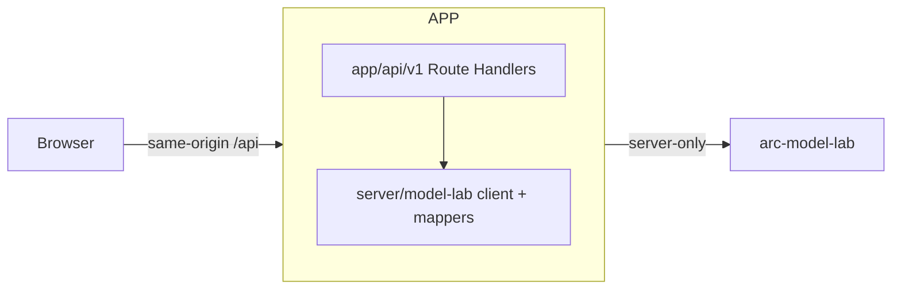

# ARC Research Console

Audience: ARC platform engineers. Reading time: 5 minutes.

The internal research console for ARC: one Next.js app that serves the UI and is
its own backend-for-frontend. It gives senior AI and research engineers direct,
honest access to two capabilities, the model catalog and inference. The surface
is dark-first, table-friendly, and keyboard-driven.

The app owns no database and no provider keys. Its only downstream is
arc-model-lab, which owns the model catalog and persists every inference run. The
browser calls only this app's own `/api` routes on the same origin; the Next
server is the BFF and is the only thing that reaches arc-model-lab.

```text
arc-platform/
  frontend/                    # the whole app (Next.js App Router)
    src/
      app/                     # UI routes + /api/v1 Route Handlers (the BFF)
      server/                  # server-only BFF: model-lab client, mappers, errors
      components/ lib/ styles/ # UI, data hooks + Zod contract, design tokens
  docker/Dockerfile            # single image (Next standalone output)
  deploy/  docs/  Makefile  README.md
```

The frontend handbook is [frontend/README.md](frontend/README.md).

## Architecture

The browser talks only to this app. The Next server holds the arc-model-lab URL
and is its only caller, so the model lab is never exposed to the browser.



- One image, one language. The Route Handlers under `app/api/v1` are the BFF, and
  `src/server` holds the model-lab client, the snake_case to camelCase mappers,
  and the error taxonomy. There is no separate service.
- One contract. Zod schemas in `src/lib/api/schemas.ts` are the single source of
  truth: the server validates the request body and the browser validates every
  response.
- Graceful degradation. Catalog and history reads return an empty list when
  arc-model-lab is unreachable, so a surface still renders. Single-resource reads
  return 404 (missing) or 503 (unreachable). Inference, a user action, fails
  loudly with 502 (bad response) or 503 (unreachable).
- Server-only boundary. `MODEL_LAB_URL` has no `NEXT_PUBLIC_` prefix and the
  server modules import `server-only`, so none of it reaches the client bundle.

## API

Internal, same-origin Route Handlers. The browser hits these; they are not a
public contract.

| Method and path                | Description                            |
| ------------------------------ | -------------------------------------- |
| `GET /api/v1/models`           | Model catalog                          |
| `GET /api/v1/models/{id}`      | Full model profile (404 if unknown)    |
| `POST /api/v1/inference`       | Run one inference (201 Created)        |
| `GET /api/v1/inference?limit=` | Recent runs, most recent first         |
| `GET /api/v1/inference/{id}`   | Full inference record (404 if unknown) |

Errors use a structured envelope: `{"detail": "...", "code": "..."}`. Codes are
`not_found`, `upstream_error`, `service_unavailable`, `invalid_request`, and
`internal_error`.

## Data model

Zod schemas in `frontend/src/lib/api/schemas.ts` are the single contract:

- Models: `modelSummarySchema` (catalog row) and `modelDetailSchema` (full
  profile). Summaries carry serving metadata (`revision`, `tokenizerId`,
  `adapterPath`, `createdAt`, `updatedAt`); detail adds `runtimeSource`,
  `description`, and `capabilities`.
- Inference: `inferenceRequestSchema`, `inferenceSummarySchema`,
  `inferenceDetailSchema`, `inferenceParamsInputSchema`, `tokenUsageSchema`.

## Running locally

Needs arc-model-lab as its downstream.

```bash
cp frontend/.env.local.example frontend/.env.local   # set MODEL_LAB_URL
make install
make dev                     # UI + BFF on :3000
curl -s localhost:3000/api/v1/models | head
```

### Configuration

| Variable                         | Default                 | Meaning                          |
| -------------------------------- | ----------------------- | -------------------------------- |
| `MODEL_LAB_URL`                  | `http://localhost:8000` | arc-model-lab base URL (server)  |
| `MODEL_LAB_TIMEOUT_MS`           | `15000`                 | catalog and history read timeout |
| `MODEL_LAB_INFERENCE_TIMEOUT_MS` | `120000`                | single-generation timeout        |

## Testing and quality

```bash
make test        # Vitest: UI components + server BFF (mappers, client policy)
make typecheck   # tsc --noEmit (strict)
make lint        # next lint + prettier check
make check       # all three
```

Tests need no external services: UI tests mock the browser client, and the server
client is tested against a mocked `fetch`.

## Docker

```bash
cp deploy/.env.example deploy/.env   # set MODEL_LAB_URL
make up                              # build + run on :3000 (docker compose)
make down                            # stop
```

One container serves the UI and the BFF on `:3000`. Its only dependency is a
reachable arc-model-lab (`MODEL_LAB_URL`); every other ARC service is deployed on
its own, from its own repo. `make docker` builds just the image.

## Phases

Phase 2 delivered the design system and app shell; Phase 3 the models surface;
Phase 4 the inference lab (`/lab`); Phase 5 inference history and detail
(`/inference`). The BFF, originally a separate FastAPI service, is now the Next
server itself (Route Handlers under `/api`), so the app ships as one image. Pages
without a real backend capability appear only as honest placeholders.
