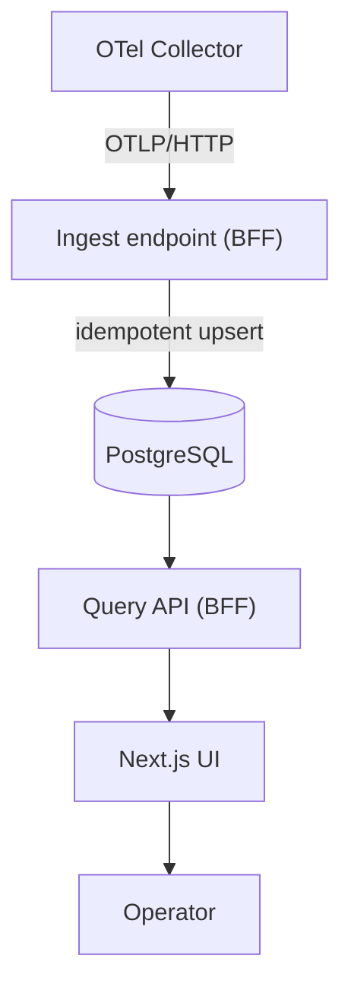

# Service — arc-platform

**Role:** the product surface for operators **and** the one stateful component.
It is three things in one repo for Phase 1: the **UI**, the **BFF**, and the
**span ingest** endpoint. It owns the PostgreSQL store.

Bundling ingest here is a deliberate MVP choice (KISS). It can be extracted into
a standalone ingest service later — see [ADR-0006](../adr/0006-postgres-span-store.md).

---

## Responsibilities



| Component | Job |
| --- | --- |
| **Ingest endpoint** | Receive spans from the Collector, normalise into the Silver tables, **idempotent upsert** on `span_id`, tolerate out-of-order arrival |
| **BFF (FastAPI)** | Query API over the span store for the UI; auth; admin (retention, tenants, content-capture) |
| **UI (Next.js)** | Trace explorer, request inspector, evaluation + guardrail dashboards |
| **DB ownership** | Migrations, retention partitions, backups |

---

## UI surfaces (Phase 1)

| Surface | Shows |
| --- | --- |
| Trace explorer | The span tree for any request; drill into timing and attributes |
| Request inspector | One request end to end: guardrail decisions, model call, scores |
| Evaluation dashboard | Pass-rate and score trends (from the gold rollups) |
| Guardrail dashboard | Block / flag rate, detection types, by tenant |

---

## Internal design

The ingest path applies the correctness invariants from the
[Data Plan §3](../data/data-plan.md#3-ingestion-correctness): idempotent upsert,
out-of-order tolerance, derived trace completion. The **mapping from span to
typed projection is a pure function** (functional core); the database write is
the shell.

```
arc_platform/
  bff/
    ingest/       # OTLP-in → normalise (pure) → upsert (shell)
    query/        # read endpoints for the UI
    admin/        # retention, tenants, content-capture
    db/           # SQLAlchemy 2.0 async models + repositories
  web/            # Next.js app (UI)
  config.py
  main.py
```

---

## Configuration

| Setting | Example | Notes |
| --- | --- | --- |
| `DATABASE_URL` | Postgres DSN | psycopg3 async |
| `RETENTION_DAYS` | `30` | drives partition lifecycle |
| `CONTENT_CAPTURE` | per-tenant | off by default |

---

## Testing

- **Ingest:** integration tests with **testcontainers** (real Postgres) covering
  idempotency, out-of-order spans, and trace completion.
- **Mapping:** the span→projection functions tested as pure units.
- **Query API:** repository tests against a seeded test database.
- **UI:** component tests on the explorer and dashboards.

## What it does **not** own
Inference, safety, scoring. It reads and displays what the other services
emitted; it never participates in the hot path.
