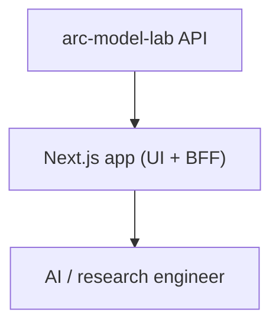

# arc-platform (ARC Research Console)

Audience: ARC platform engineers. Reading time: 4 minutes.

Role: the product surface for AI and research engineers. One Next.js app that
serves the UI and is its own backend-for-frontend (Route Handlers under `/api`).
It owns no database and no provider keys. Its only downstream is arc-model-lab,
which owns the model catalog and persists inference runs.

## Responsibilities



| Component | Job |
| --- | --- |
| Route Handlers (`app/api`) + `src/server` | Read the model catalog and inference history; run inference; normalize snake_case into a camelCase UI contract |
| UI (Next.js App Router) | Models surface, inference lab, inference history and detail |

## Boundaries

- The browser calls only this app's `/api` routes.
- The Next server (the BFF) calls only arc-model-lab.
- No database, no queues, no plugin system, no local persistence.
- Current capabilities are Model and Inference only. Future surfaces exist as
  honest placeholders until a backend capability exists.

## Internal design

Layering is one-directional: Route Handlers delegate to the model-lab client and
shape nothing. The client owns I/O plus normalization: it maps arc-model-lab
records onto the camelCase Zod contract, degrades reads to empty, and raises
typed errors the handlers turn into safe responses.

```text
frontend/src/
  app/api/v1/        # Route Handlers: models, inference (the BFF)
  server/
    config.ts        # MODEL_LAB_URL + timeouts (server-only)
    errors.ts        # typed errors -> {detail, code} HTTP envelope
    model-lab/       # client (fetch + degrade policy) + snake->camel mappers
  lib/api/schemas.ts # the camelCase Zod contract (single source of truth)
```

## Failure policy

| Situation | Result |
| --- | --- |
| Catalog or history read, arc-model-lab down | Empty list, 200 |
| Single model or run, not found | 404 `not_found` |
| Single model or run, arc-model-lab unreachable | 503 `service_unavailable` |
| Inference, arc-model-lab returns an error | 502 `upstream_error` |
| Inference, arc-model-lab unreachable | 503 `service_unavailable` |
| Any unexpected error | 500 `internal_error`, no stack trace |

## Configuration

| Setting | Default | Notes |
| --- | --- | --- |
| `MODEL_LAB_URL` | `http://localhost:8000` | arc-model-lab base URL (server-only) |
| `MODEL_LAB_TIMEOUT_MS` | `15000` | read timeout |
| `MODEL_LAB_INFERENCE_TIMEOUT_MS` | `120000` | inference timeout |

## Testing

- Server: the model-lab client's failure policy against a mocked `fetch`, plus
  the pure record mappers.
- UI: components via React Testing Library with the browser client mocked.

## What it does not own

Model hosting, inference execution, weights, provider keys, and any database.
arc-model-lab owns those. The console reads and drives; it never stores.
