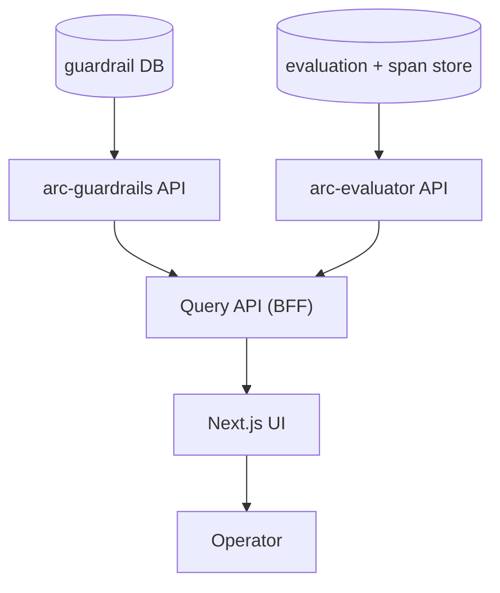

# Service — arc-platform

**Role:** the product surface for operators. It is the **UI** plus a thin
**BFF**, and owns **no database**: it reads from `arc-guardrails` and
`arc-evaluator` via their APIs. Traces come from the evaluator, which owns the
span store ([ADR-0006](../adr/0006-postgres-span-store.md)).

Keeping the platform read-only (KISS) means each domain owns its data. It can
grow a cache or aggregation store later if query latency demands — see
[ADR-0006](../adr/0006-postgres-span-store.md).

---

## Responsibilities



| Component | Job |
| --- | --- |
| **BFF (FastAPI)** | Read-only query API that aggregates guardrail, eval and trace data for the UI; auth; admin |
| **Connections (BYOK)** | Tenants sync provider/infra tokens here; secrets go to the secret manager, only metadata to the DB; see [ADR-0010](../adr/0010-byok-provider-credentials.md) |
| **UI (Next.js)** | Trace explorer, request inspector, evaluation + guardrail dashboards |

---

## UI surfaces (Phase 1)

| Surface | Shows |
| --- | --- |
| Trace explorer | The span tree for any request; drill into timing and attributes |
| Request inspector | One request end to end: guardrail decisions, model call, scores |
| Evaluation dashboard | Pass-rate and score trends (from the gold rollups) |
| Guardrail dashboard | Block / flag rate, detection types, by tenant |
| Provider connections | Sync/rotate provider API tokens (write-only); status + last-4 hint |

---

## Internal design

The BFF is a **read-only aggregation layer**: typed httpx clients call the
guardrail and evaluator APIs, and the BFF composes their responses for the UI.
The trace explorer renders the **real span tree** the evaluator serves at
`GET /v1/traces/{trace_id}` (not a waterfall reconstructed from latencies), so
the inspector shows the actual `arc.llm.*` and `arc.eval.*` attributes. There is
no write path and no database.

```
arc_platform/
  bff/
    query/        # read endpoints for the UI
    clients/      # guardrail + evaluator API clients
    admin/        # tenants, content-capture toggles
  web/            # Next.js app (UI)
  config.py
  main.py
```

---

## Configuration

| Setting | Example | Notes |
| --- | --- | --- |
| `GUARDRAILS_URL` / `EVALUATOR_URL` | internal URLs | read APIs (traces come from the evaluator) |
| `SECRET_MANAGER` | `gcp` | BYOK secret + metadata backend (Vault-compatible) |
| `CONTENT_CAPTURE` | per-tenant | off by default |

---

## Testing

- **Clients:** API clients tested against **respx**-recorded guardrail/evaluator
  responses (no network).
- **Query API:** BFF aggregation tested with stubbed upstreams.
- **UI:** component tests on the explorer and dashboards.

## What it does **not** own
Inference, safety, scoring, **any database**. It reads and displays what the
other services emitted; it never participates in the hot path.
