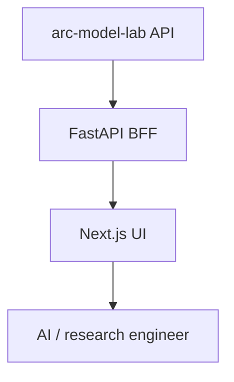

# arc-platform (ARC Research Console)

Audience: ARC platform engineers. Reading time: 4 minutes.

Role: the product surface for AI and research engineers. A Next.js UI plus a thin
FastAPI BFF. It owns no database and no provider keys. Its only downstream is
arc-model-lab, which owns the model catalog and persists inference runs.

## Responsibilities



| Component | Job |
| --- | --- |
| BFF (FastAPI) | Read the model catalog and inference history; run inference; normalize snake_case into a camelCase UI contract |
| UI (Next.js) | Models surface, inference lab, inference history and detail |

## Boundaries

- The browser calls only the BFF.
- The BFF calls only arc-model-lab.
- No database, no queues, no plugin system, no local persistence.
- Current capabilities are Model and Inference only. Future surfaces exist as
  honest placeholders until a backend capability exists.

## Internal design

Layering is one-directional: api to services to client. Routes delegate to
services and shape nothing. Services own serving policy (ordering, limits). The
client owns I/O plus normalization: it maps arc-model-lab records onto Pydantic
contracts and raises typed errors.

```text
arc_platform/
  main.py            # app assembly, CORS, exception handlers
  api/routes/        # health, models, inference
  services/          # model_service, inference_service
  clients/           # model_lab_client
  core/              # config, logging, telemetry, errors, deps
  schemas/           # models, inference, health, base (CamelModel)
```

## Failure policy

| Situation | Result |
| --- | --- |
| Catalog or history read, arc-model-lab down | Empty list, 200 |
| Single model or run, not found | 404 `not_found` |
| Single model or run, arc-model-lab unreachable | 503 `service_unavailable` |
| Inference, arc-model-lab returns an error | 502 `upstream_error` |
| Inference, arc-model-lab unreachable | 503 `service_unavailable` |
| Any unexpected error | 500 `internal_error`, no stack trace |

## Configuration

| Setting | Default | Notes |
| --- | --- | --- |
| `ARC_PLATFORM_MODEL_LAB_URL` | `http://localhost:8000` | arc-model-lab base URL |
| `ARC_PLATFORM_MODEL_LAB_TIMEOUT_S` | `15.0` | read timeout |
| `ARC_PLATFORM_MODEL_LAB_INFERENCE_TIMEOUT_S` | `120.0` | inference timeout |
| `ARC_PLATFORM_CORS_ORIGINS` | `http://localhost:3000` | allowed UI origin |

## Testing

- Contract: ModelLabClient against respx-recorded arc-model-lab responses.
- Unit: service ordering and limits, plus the pure record mappers.
- Integration: routes via httpx AsyncClient with a fake downstream.
- e2e: run inference, then read it back from history and detail.

## What it does not own

Model hosting, inference execution, weights, provider keys, and any database.
arc-model-lab owns those. The console reads and drives; it never stores.
