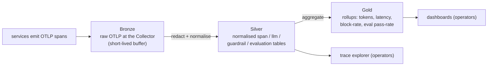

# Data Plan

This document describes the data ARC handles: what it is, how sensitive it is,
how it flows, and how long it lives. The physical tables are in
[Database Schema](database-schema.md).

ARC's data philosophy follows directly from its architecture: **each domain owns
its data.** Guardrail decisions live in the guardrail DB, evaluation results in
the evaluation DB, and spans/traces in the evaluator's span store. `arc-platform`
reads across all three via API and owns nothing.

---

## 1. Data domains

| Domain | Description | Origin | Sensitivity |
| --- | --- | --- | --- |
| Trace / span | The structure and timing of each request | All services | Low (metadata) |
| GenAI metadata | Model, provider, token usage, finish reason | Gateway provider span | Low |
| Guardrail decisions | allow / block / flag, detection types | Guardrails | Medium (reveals what was flagged) |
| Evaluation results | Scores, pass/fail, thresholds | Evaluator | Low |
| Request content | Raw prompts and completions | Client + provider | **High (may contain PII)** |
| Provider credentials | Tenant BYOK API tokens | Tenant via platform | **Critical (secret manager only)** |

The first four are always stored. The fifth is **not stored by default** — see
[§4 Classification](#4-classification-and-pii).

---

## 2. Data flow (bronze → silver → gold)

ARC uses a three-tier shape. It keeps raw fidelity available for a short window,
a clean queryable model for operations, and small rollups for dashboards.

| Tier | Form | Purpose | Lifetime |
| --- | --- | --- | --- |
| Bronze | Raw OTLP in the Collector pipeline | Transport + redaction | Seconds (in-flight) |
| Silver | Normalised relational tables | The operational source of truth, queryable | 30–90 days (configurable) |
| Gold | Aggregated metrics | Dashboards and trends | 12+ months |

The Silver layer is the heart of the system. It is a normalised `span` table
plus typed projections (`llm_request`, `guardrail_decision`, `evaluation`).
This is what makes traces and evals queryable with plain SQL instead of a
proprietary query language.

---

## 3. Ingestion correctness

Spans for one trace do not arrive together or in order. The ingest layer must be
correct under this reality. Three invariants:

- **Idempotent upserts.** Each span is upserted on its `span_id` primary key.
  Duplicate or retried OTLP exports are harmless.
- **Out-of-order tolerance.** A child span may land before its parent. Rows are
  written independently; the parent link is a (nullable until resolved) foreign
  reference, never a blocking precondition.
- **Trace completion is derived, not assumed.** A trace is considered "complete"
  when its root span (`infer_request`) has arrived and a short quiet period has
  passed with no new spans. Late spans still upsert correctly after that.

These rules are what let ARC store telemetry safely without a heavyweight stream
processor. They are encoded in [ADR-0006](../adr/0006-postgres-span-store.md).

---

## 4. Classification and PII

| Class | Examples | Rule |
| --- | --- | --- |
| **Public / metadata** | model name, token counts, latency, status | Store freely |
| **Operational** | guardrail decisions, eval scores, tenant id | Store; access-controlled |
| **Sensitive** | raw prompts, completions, detected PII values | **Do not store by default** |
| **Critical** | tenant provider API tokens (BYOK) | **Secret manager only; never in DB/spans/logs** |

When content capture is enabled for a tenant, the data still passes through the
Collector's **redaction processor** before storage. Detected PII is recorded as
a *type* (`pii.email`) and never as the *value*. The guardrails service performs
the first-line, hot-path detection; the Collector performs the storage-time
redaction. Two independent layers, by design.

This matches the OpenTelemetry guidance that GenAI content attributes are
opt-in and privacy-sensitive. See
[Observability §7](../architecture/observability.md#7-content-capture-and-pii).

---

## 5. Retention and lifecycle

Retention is enforced by **time-based table partitioning** plus a scheduled
drop of old partitions — cheap, and far better than row-by-row deletes.

| Data | Default retention | Mechanism |
| --- | --- | --- |
| Silver spans / decisions / evals | 30 days (tunable to 90) | Monthly partitions, drop old |
| Gold rollups | 12+ months | Small aggregate tables |
| Any captured content (if enabled) | 7 days, redacted | Separate short-TTL partition |

---

## 6. Multi-tenancy

Every row carries `tenant_id`. For Phase 1 this is a column and an index, not
separate schemas or databases (YAGNI). It is present from day one so that
per-tenant retention, access control, and quotas can be added later without a
migration of the data model. Physical isolation per tenant is a deferred,
trigger-based decision, not a Phase 1 cost.

---

## 7. Access and governance

| Audience | Access | Via |
| --- | --- | --- |
| Operators / engineers | Read traces and dashboards | arc-platform UI (authn required) |
| Services | Write spans only | OTLP → Collector (no direct DB) |
| Admins | Configure retention, tenants, content-capture | Platform admin surface |

No service except `arc-platform` touches the database. This single-writer,
single-owner rule is what keeps the data model coherent in a polyrepo world.
