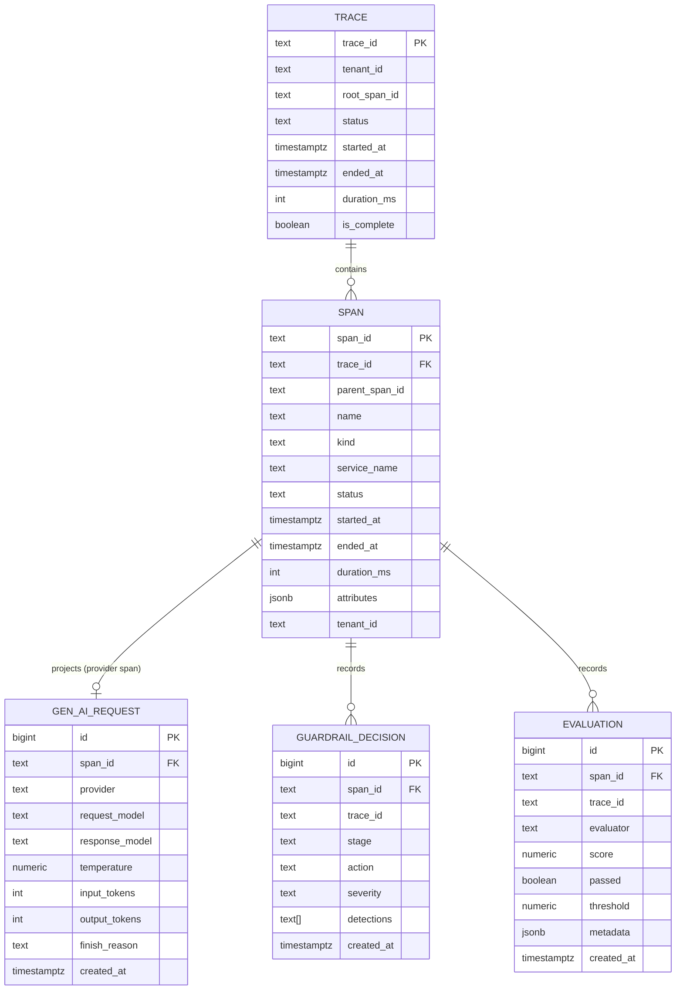

# Database Schema

This is the physical model for the one stateful component in ARC: the
PostgreSQL **span / evaluation store**, owned by `arc-platform`. The reasoning
behind a relational trace store is in
[ADR-0006](../adr/0006-postgres-span-store.md); the data philosophy is in the
[Data Plan](data-plan.md).

It is a **Silver layer**: normalised, queryable, derived from emitted spans.

---

## 1. Entity-relationship diagram



**Why this shape.** `span` is the generic backbone (anything OTel emits fits
here as `attributes JSONB`). The other three tables are **typed projections** of
specific span kinds, so the common queries — "tokens per model", "block rate per
tenant", "eval pass rate over time" — are plain indexed SQL, not JSON spelunking.

---

## 2. DDL

```sql
-- ============================================================
-- TRACE: one row per request, derived/rolled-up from spans.
-- ============================================================
CREATE TABLE trace (
    trace_id      text        PRIMARY KEY,
    tenant_id     text        NOT NULL,
    root_span_id  text,
    status        text        NOT NULL DEFAULT 'unset',   -- ok | error | unset
    started_at    timestamptz NOT NULL,
    ended_at      timestamptz,
    duration_ms   integer,
    is_complete   boolean     NOT NULL DEFAULT false,
    created_at    timestamptz NOT NULL DEFAULT now()
);

CREATE INDEX trace_tenant_started_idx ON trace (tenant_id, started_at DESC);
CREATE INDEX trace_started_brin       ON trace USING brin (started_at);

-- ============================================================
-- SPAN: normalised backbone. Time-partitioned for retention.
-- ============================================================
CREATE TABLE span (
    span_id        text        NOT NULL,
    trace_id       text        NOT NULL,
    parent_span_id text,
    name           text        NOT NULL,
    kind           text        NOT NULL,                  -- server | client | internal
    service_name   text        NOT NULL,
    status         text        NOT NULL DEFAULT 'unset',
    started_at     timestamptz NOT NULL,
    ended_at       timestamptz,
    duration_ms    integer,
    attributes     jsonb       NOT NULL DEFAULT '{}'::jsonb,
    tenant_id      text        NOT NULL,
    PRIMARY KEY (span_id, started_at)                      -- span_id is the upsert key
) PARTITION BY RANGE (started_at);

-- Example monthly partition (created ahead of time by a maintenance job).
CREATE TABLE span_2026_07 PARTITION OF span
    FOR VALUES FROM ('2026-07-01') TO ('2026-08-01');

CREATE INDEX span_trace_idx      ON span (trace_id);
CREATE INDEX span_tenant_idx     ON span (tenant_id, started_at DESC);
CREATE INDEX span_started_brin   ON span USING brin (started_at);
CREATE INDEX span_attrs_gin      ON span USING gin (attributes jsonb_path_ops);

-- ============================================================
-- GEN_AI_REQUEST: typed projection of the provider span.
-- ============================================================
CREATE TABLE gen_ai_request (
    id             bigint GENERATED ALWAYS AS IDENTITY PRIMARY KEY,
    span_id        text        NOT NULL,
    trace_id       text        NOT NULL,
    provider       text        NOT NULL,                  -- gen_ai.provider.name
    request_model  text        NOT NULL,                  -- gen_ai.request.model
    response_model text,
    temperature    numeric,
    input_tokens   integer,
    output_tokens  integer,
    finish_reason  text,
    created_at     timestamptz NOT NULL DEFAULT now(),
    UNIQUE (span_id)                                       -- one projection per span
);

CREATE INDEX gen_ai_model_idx ON gen_ai_request (request_model, created_at DESC);

-- ============================================================
-- GUARDRAIL_DECISION: one row per guardrail evaluation.
-- ============================================================
CREATE TABLE guardrail_decision (
    id          bigint GENERATED ALWAYS AS IDENTITY PRIMARY KEY,
    span_id     text        NOT NULL,
    trace_id    text        NOT NULL,
    stage       text        NOT NULL,                      -- request | response
    action      text        NOT NULL,                      -- allow | block | flag
    severity    text,                                      -- low | medium | high
    detections  text[]      NOT NULL DEFAULT '{}',         -- e.g. {pii.email,injection}
    tenant_id   text        NOT NULL,
    created_at  timestamptz NOT NULL DEFAULT now(),
    UNIQUE (span_id, stage)
);

CREATE INDEX guardrail_action_idx ON guardrail_decision (tenant_id, action, created_at DESC);

-- ============================================================
-- EVALUATION: one row per evaluator that scored the response.
-- ============================================================
CREATE TABLE evaluation (
    id          bigint GENERATED ALWAYS AS IDENTITY PRIMARY KEY,
    span_id     text        NOT NULL,
    trace_id    text        NOT NULL,
    evaluator   text        NOT NULL,                      -- refusal | length | latency
    score       numeric,
    passed      boolean,
    threshold   numeric,
    metadata    jsonb       NOT NULL DEFAULT '{}'::jsonb,
    tenant_id   text        NOT NULL,
    created_at  timestamptz NOT NULL DEFAULT now(),
    UNIQUE (span_id, evaluator)
);

CREATE INDEX evaluation_eval_idx ON evaluation (evaluator, created_at DESC);
```

---

## 3. Key design choices

| Choice | Why |
| --- | --- |
| `span_id` is the upsert key | Idempotent ingest; duplicate OTLP exports are harmless |
| `parent_span_id` is **not** an enforced FK | Children may arrive before parents; no blocking on lineage |
| `span` is **range-partitioned by `started_at`** | Retention = drop a partition, O(1), no vacuum storms |
| **BRIN** index on time columns | Tiny, perfect for append-only time-ordered data |
| **GIN** index on `attributes` | Ad-hoc queries into the open `arc.*` / `gen_ai.*` tail |
| Typed projection tables | Hot queries stay indexed SQL, not JSONB scans |
| `tenant_id` on every table | Per-tenant retention / access / quotas later, no migration |

---

## 4. Representative queries

```sql
-- Token usage by model, last 24h
SELECT request_model,
       sum(input_tokens)  AS in_tokens,
       sum(output_tokens) AS out_tokens
FROM gen_ai_request
WHERE created_at >= now() - interval '24 hours'
GROUP BY request_model
ORDER BY out_tokens DESC;

-- Guardrail block rate by tenant, last 7d
SELECT tenant_id,
       count(*) FILTER (WHERE action = 'block')::numeric / count(*) AS block_rate
FROM guardrail_decision
WHERE created_at >= now() - interval '7 days'
GROUP BY tenant_id;

-- Full trace for one request (operator drill-down)
SELECT span_id, parent_span_id, name, service_name, duration_ms, status
FROM span
WHERE trace_id = $1
ORDER BY started_at;
```

---

## 5. Migrations

Schema changes ship as versioned, reviewed migrations applied before the code
that depends on them, using expand/contract for any breaking change so deploys
stay zero-downtime. Tooling choice and the expand/contract discipline are part
of [ADR-0009](../adr/0009-python-tooling.md) and the
[Conventions](../onboarding/conventions.md) doc.
