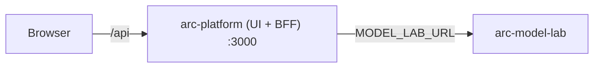

# Running arc-platform locally

Audience: ARC platform engineers. Reading time: 3 minutes.

arc-platform runs standalone. It is one Next.js app (the UI and its own BFF)
whose only dependency is a reachable arc-model-lab, given as a URL. Every other
ARC service (arc-model-lab, arc-eval-service) is run and deployed on its own,
from its own repo. This repo needs no knowledge of how to build them, and this
guide never asks you to.

## How it connects



The browser calls only arc-platform. The Next server is the BFF and the only
thing that reaches arc-model-lab. Moving between environments is a one-line URL
change.

## Prerequisites

| Tool   | Version | For                        |
| ------ | ------- | -------------------------- |
| Node   | >= 20   | the app (dev and build)    |
| Docker | recent  | the container (optional)   |

Plus a running arc-model-lab, reachable at a URL. Start it from its own repo.

## Dev (hot reload)

```bash
cp frontend/.env.local.example frontend/.env.local   # set MODEL_LAB_URL
make install
make dev            # http://localhost:3000
```

`MODEL_LAB_URL` defaults to `http://localhost:8000`. Point it at wherever your
model lab runs.

## Container (single image)

```bash
cp deploy/.env.example deploy/.env    # set MODEL_LAB_URL
make up                                # build + run on :3000
make down                              # stop
```

From inside a container, a model lab bound to your host is
`http://host.docker.internal:8000` (the compose file wires this for Linux too).

## Configuration

| Variable                         | Default (dev / container)                     |
| -------------------------------- | --------------------------------------------- |
| `MODEL_LAB_URL`                  | `http://localhost:8000` / `host.docker.internal:8000` |
| `MODEL_LAB_TIMEOUT_MS`           | `15000`                                       |
| `MODEL_LAB_INFERENCE_TIMEOUT_MS` | `120000`                                      |

`MODEL_LAB_URL` is read server-side only and never reaches the browser bundle.
