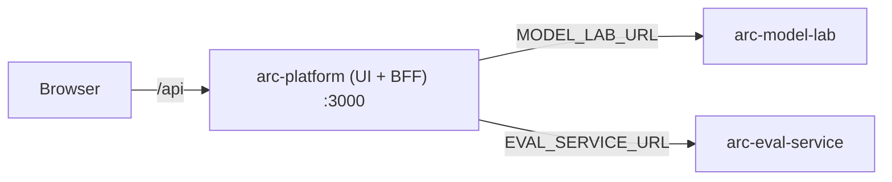

# Running arc-platform locally

Audience: ARC platform engineers. Reading time: 3 minutes.

arc-platform runs standalone. It is one Next.js app (the UI and its own BFF)
whose dependencies are two reachable backends, each given as a URL:
arc-model-lab (the model catalog and inference) and arc-eval-service (metric
scoring, evaluation records, and experiments). Every ARC service
is run and deployed on its own, from its own repo. This repo needs no knowledge
of how to build them, and this guide never asks you to.

## How it connects



The browser calls only arc-platform. The Next server is the BFF and the only
thing that reaches the backends. Moving between environments is a URL change.

## Prerequisites

| Tool   | Version | For                        |
| ------ | ------- | -------------------------- |
| Node   | >= 20   | the app (dev and build)    |
| Docker | recent  | the container (optional)   |

Plus a running arc-model-lab and arc-eval-service, each reachable at a URL. Start
them from their own repos. arc-eval-service commonly runs on 8001 so it sits
alongside arc-model-lab (8000) locally. To bring all three up on one machine, see
[running-end-to-end.md](running-end-to-end.md).

## Dev (hot reload)

```bash
cp frontend/.env.local.example frontend/.env.local   # set MODEL_LAB_URL + EVAL_SERVICE_URL
make install
make dev            # http://localhost:3000
```

`MODEL_LAB_URL` defaults to `http://localhost:8000` and `EVAL_SERVICE_URL` to
`http://localhost:8001`. Point them at wherever your backends run.

## Container (single image)

```bash
cp deploy/.env.example deploy/.env    # set MODEL_LAB_URL + EVAL_SERVICE_URL
make up                                # build + run on :3000
make down                              # stop
```

From inside a container, a model lab bound to your host is
`http://host.docker.internal:8000` (the compose file wires this for Linux too).

## Configuration

| Variable                         | Default (dev / container)                     |
| -------------------------------- | --------------------------------------------- |
| `MODEL_LAB_URL`                  | `http://localhost:8000` / `host.docker.internal:8000` |
| `EVAL_SERVICE_URL`               | `http://localhost:8001` / `host.docker.internal:8001` |
| `MODEL_LAB_TIMEOUT_MS`           | `15000`                                       |
| `MODEL_LAB_INFERENCE_TIMEOUT_MS` | `120000`                                      |
| `EVAL_SERVICE_TIMEOUT_MS`        | `15000`                                       |

Both backend URLs are read server-side only and never reach the browser bundle.
