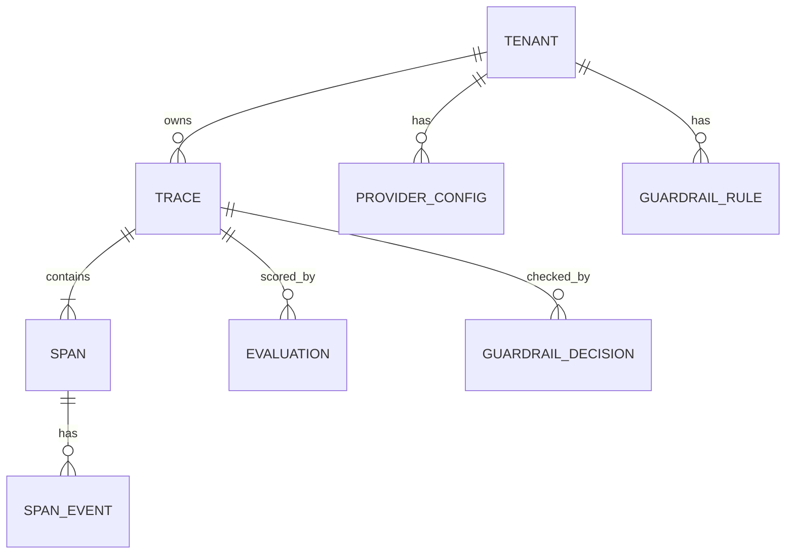

# Database Schema

One PostgreSQL 16 database is the MVP system of record for traces, spans,
evaluations, guardrail decisions, and per-tenant config. This document gives the
concrete DDL, the indexing and partitioning strategy, the migration approach, and
the PgBouncer/`psycopg3` operational notes.

Conceptual model and rationale are in the
[data plan](../architecture/data-model-and-telemetry.md).

---

## 1. Conventions

- All ids are `uuid` (`gen_random_uuid()` from `pgcrypto`), except `request_id`
  which is a ULID string generated at the edge for human readability.
- All timestamps are `timestamptz`, stored in UTC.
- Evolving, sparsely-queried fields use `jsonb`. Hot, filtered fields are real
  columns.
- Every tenant-scoped table carries `tenant_id` and is indexed on it.

---

## 2. Extensions and enums

```sql
CREATE EXTENSION IF NOT EXISTS pgcrypto;   -- gen_random_uuid()
-- pgvector is NOT enabled for MVP; reserved for Phase 2 semantic cache.

CREATE TYPE trace_status      AS ENUM ('ok', 'blocked', 'error');
CREATE TYPE guardrail_phase   AS ENUM ('request', 'response');
CREATE TYPE guardrail_outcome AS ENUM ('allow', 'block', 'bypassed');
CREATE TYPE eval_verdict      AS ENUM ('pass', 'warn', 'fail');
```

---

## 3. Tenancy and config

```sql
CREATE TABLE tenant (
    id            uuid PRIMARY KEY DEFAULT gen_random_uuid(),
    name          text NOT NULL,
    api_key_hash  text NOT NULL UNIQUE,        -- sha256 of the API key
    settings      jsonb NOT NULL DEFAULT '{}', -- e.g. {"fail_open": false, "capture_raw": false}
    created_at    timestamptz NOT NULL DEFAULT now()
);

CREATE TABLE provider_config (
    id          uuid PRIMARY KEY DEFAULT gen_random_uuid(),
    tenant_id   uuid NOT NULL REFERENCES tenant(id) ON DELETE CASCADE,
    provider    text NOT NULL,                 -- 'vertex' | 'openai' | 'anthropic'
    model       text NOT NULL,
    params      jsonb NOT NULL DEFAULT '{}',   -- temperature, max_tokens, ...
    enabled     boolean NOT NULL DEFAULT true,
    UNIQUE (tenant_id, provider, model)
);

CREATE TABLE guardrail_rule (
    id          uuid PRIMARY KEY DEFAULT gen_random_uuid(),
    tenant_id   uuid NOT NULL REFERENCES tenant(id) ON DELETE CASCADE,
    kind        text NOT NULL,                 -- 'pii' | 'prompt_injection' | 'jailbreak'
    config      jsonb NOT NULL DEFAULT '{}',
    enabled     boolean NOT NULL DEFAULT true
);

CREATE INDEX idx_provider_config_tenant ON provider_config (tenant_id);
CREATE INDEX idx_guardrail_rule_tenant  ON guardrail_rule  (tenant_id);
```

---

## 4. Telemetry: traces and spans (partitioned)

`trace` and `span` are the high-volume tables. Both are **range-partitioned by
month** on `started_at` so retention is a partition `DROP` instead of a slow
`DELETE`.

```sql
CREATE TABLE trace (
    trace_id    uuid NOT NULL,
    tenant_id   uuid NOT NULL,
    request_id  text NOT NULL,
    provider    text,
    model       text,
    status      trace_status NOT NULL DEFAULT 'ok',
    latency_ms  integer,
    started_at  timestamptz NOT NULL,
    ended_at    timestamptz,
    PRIMARY KEY (trace_id, started_at)         -- partition key must be in PK
) PARTITION BY RANGE (started_at);

CREATE TABLE span (
    span_id        uuid NOT NULL,
    trace_id       uuid NOT NULL,
    parent_span_id uuid,
    name           text NOT NULL,              -- 'infer_request', 'provider_call', ...
    status         text NOT NULL DEFAULT 'ok',
    attributes     jsonb NOT NULL DEFAULT '{}',
    started_at     timestamptz NOT NULL,
    ended_at       timestamptz,
    PRIMARY KEY (span_id, started_at)
) PARTITION BY RANGE (started_at);

CREATE TABLE span_event (
    id          uuid NOT NULL DEFAULT gen_random_uuid(),
    span_id     uuid NOT NULL,
    name        text NOT NULL,
    attributes  jsonb NOT NULL DEFAULT '{}',
    at          timestamptz NOT NULL,
    PRIMARY KEY (id, at)
) PARTITION BY RANGE (at);
```

### Indexes

```sql
-- Trace explorer: filter by tenant + time, newest first.
CREATE INDEX idx_trace_tenant_time   ON trace (tenant_id, started_at DESC);
CREATE INDEX idx_trace_request_id    ON trace (request_id);
CREATE INDEX idx_trace_status        ON trace (tenant_id, status, started_at DESC);

-- Span lookup by trace (the request inspector), and by name (eval targeting).
CREATE INDEX idx_span_trace          ON span (trace_id);
CREATE INDEX idx_span_name_time      ON span (name, started_at DESC);

-- Attribute search when needed (GIN over JSONB).
CREATE INDEX idx_span_attributes_gin ON span USING gin (attributes jsonb_path_ops);
```

### Partition management

```sql
-- Example month partition (created ahead of time by the maintenance job).
CREATE TABLE trace_2026_07 PARTITION OF trace
    FOR VALUES FROM ('2026-07-01') TO ('2026-08-01');
CREATE TABLE span_2026_07 PARTITION OF span
    FOR VALUES FROM ('2026-07-01') TO ('2026-08-01');
```

A scheduled maintenance job (Cloud Scheduler → reconciler) creates next month's
partitions ahead of time and drops partitions past the retention TTL. Because
this is monotone (only future partitions are added, only expired ones dropped),
it is safe to run repeatedly — an idempotent operation.

---

## 5. Evaluation and guardrail decisions

```sql
CREATE TABLE evaluation (
    id          uuid PRIMARY KEY DEFAULT gen_random_uuid(),
    trace_id    uuid NOT NULL,
    tenant_id   uuid NOT NULL,
    evaluator   text NOT NULL,                 -- 'latency' | 'length' | 'schema' | ...
    verdict     eval_verdict NOT NULL,
    score       numeric(6,4),
    detail      jsonb NOT NULL DEFAULT '{}',
    created_at  timestamptz NOT NULL DEFAULT now(),
    UNIQUE (trace_id, evaluator)               -- idempotent upsert target
);

CREATE TABLE guardrail_decision (
    id          uuid PRIMARY KEY DEFAULT gen_random_uuid(),
    trace_id    uuid NOT NULL,
    tenant_id   uuid NOT NULL,
    phase       guardrail_phase NOT NULL,
    decision    guardrail_outcome NOT NULL,
    findings    jsonb NOT NULL DEFAULT '[]',   -- [{type, count}], never raw values
    created_at  timestamptz NOT NULL DEFAULT now(),
    UNIQUE (trace_id, phase)
);

CREATE INDEX idx_eval_tenant_time     ON evaluation (tenant_id, created_at DESC);
CREATE INDEX idx_eval_verdict         ON evaluation (tenant_id, verdict, created_at DESC);
CREATE INDEX idx_decision_tenant_time ON guardrail_decision (tenant_id, created_at DESC);
CREATE INDEX idx_decision_outcome     ON guardrail_decision (tenant_id, decision, created_at DESC);
```

The `UNIQUE (trace_id, evaluator)` and `UNIQUE (trace_id, phase)` constraints are
the idempotency keys. The consumer writes with
`INSERT ... ON CONFLICT DO UPDATE`, so re-processing a trace (at-least-once
delivery) never produces duplicates.

---

## 6. Migrations (Alembic)

- All schema changes go through Alembic. Autogenerate is a starting point, not
  the source of truth — every migration is reviewed by hand.
- **Expand / contract** for zero-downtime changes: add nullable column → backfill
  → start writing → switch reads → drop old column, across separate deploys.
- Destructive DDL (`DROP COLUMN`, type changes) is split from additive DDL and
  gated behind a feature flag where it touches the hot path.
- Migrations run as a separate Cloud Run Job before the new revision serves
  traffic, never inside the app's startup.

```text
migrations/
├── env.py
├── versions/
│   ├── 0001_initial_schema.py
│   ├── 0002_add_partitions.py
│   └── ...
```

---

## 7. PgBouncer + `psycopg3` operational notes

ARC runs behind **PgBouncer in transaction pooling mode** to keep the Postgres
connection count bounded under Cloud Run concurrency. Two things this requires:

1. **Disable server-side prepared statements** (transaction pooling does not
   guarantee the same server connection across statements). With `psycopg3`:

   ```python
   # SQLAlchemy 2.0 async engine
   engine = create_async_engine(
       settings.database_url,
       connect_args={"prepare_threshold": None},  # psycopg3: no auto-prepare
       pool_pre_ping=True,
   )
   ```

2. **Do not rely on session-level state** (e.g. `SET`, advisory locks held across
   statements, `LISTEN/NOTIFY`) on pooled connections. Anything needing session
   affinity uses a separate, directly-connected engine.

App-side pooling is kept small (PgBouncer is the real pool); SQLAlchemy's pool is
sized to the per-instance concurrency, not the cluster.

---

## 8. Quick ER reference


